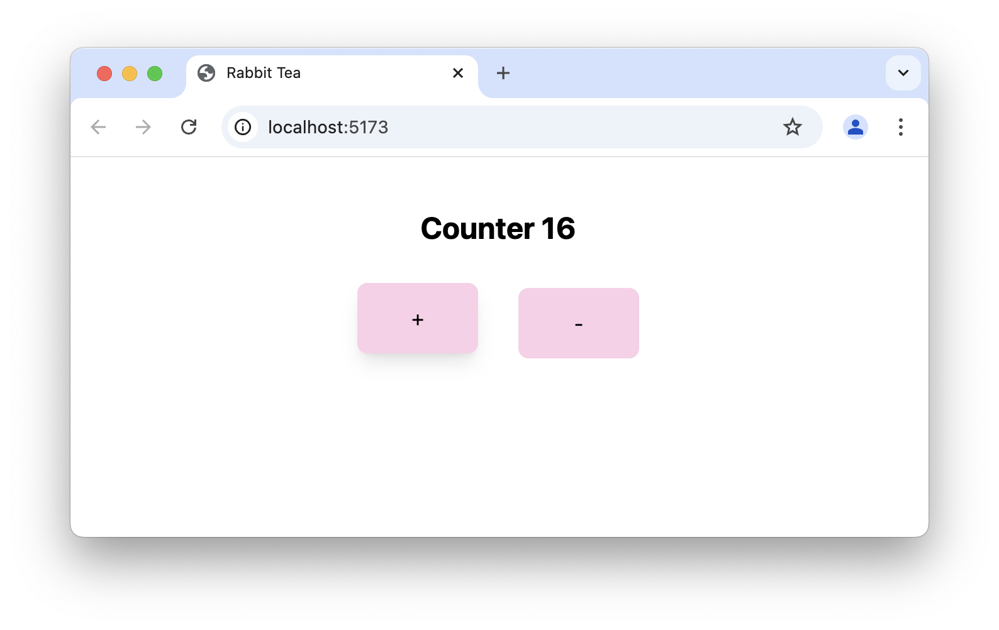

# rabbit-tea template

Template for web app using MoonBit, Rabbit-TEA, and Tailwind CSS.



# Getting started

Clone this repository and run the following commands in the project directory:

```
moon update
moon add Yoorkin/rabbit-tea
npm i
npm run dev
```
or using bun:

```
moon update
moon add Yoorkin/rabbit-tea
bun i
bun run dev
```
## Debug

Use the following steps to debug MoonBit code in VSCode:

1. Open the JavaScript Debug Terminal:

    Press `Shift + Command + P` on Mac or `Ctrl + Shift + P` on Windows/Linux to open the command palette. Search for `Debug: JavaScript Debug Terminal` and run it.

2. Run the `bun run dev` command in the JavaScript Debug Terminal.

3. Set breakpoints in the MoonBit code.

4. Open the browser and visit the link displayed in the terminal. The breakpoints will be triggered when the code is executed.

## Use with Tailwind CSS 

To get better completion experience in vscode, you can install 
the [Tailwind CSS IntelliSense extension](https://marketplace.visualstudio.com/items?itemName=bradlc.vscode-tailwindcss).

The `.vscode/settings.json` file is configured to enable Tailwind CSS completions specifically for MoonBit.

## Release build

```
npm run build
```

or using bun:

```
bun run build
```

The release build will be generated in the `src/dist` directory.
